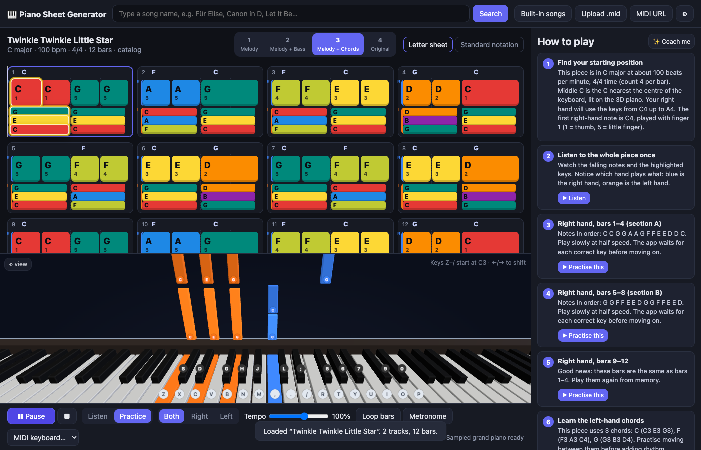

# Piano Sheet Generator

Type a song name, get a beginner-friendly piano arrangement in six stages, and learn it
on a 3D piano in the browser. Built for self-learners who cannot read sheet music; standard notation
is one click away for those who can.



## Features

- **Song search** on bitmidi.com (no backend needed), re-ranked locally and grouped one card per song, plus `.mid` upload, MIDI URL, and 8 bundled
  public-domain pieces (Twinkle Twinkle, Ode to Joy, Für Elise, Canon in D, …).
- **Version comparison**: open a song's versions and the app downloads and analyses the top uploads, badges each one
  (piano only or band, length, hand split, melody confidence, difficulty, suggested stage), stars the best file for a
  beginner, sorts by easiest, most complete, most popular or piano-only, and previews eight bars of the melody before you commit.
- **Six stages** generated from any MIDI: 1 Melody · 2 + Bass · 3 + Fifths · 4 + Chords · 5 + Pattern (waltz, Alberti or broken chord by meter) · 6 Original piano parts. Stages 1–3 move to the key with the fewest black keys (toggle), new notes glow at each stage, much harder sections are shown one stage easier, and the difficulty fingerprint picks where to start.
- **Letter sheet**: colour-coded note pills with letter names, finger numbers and chord symbols.
- **Standard notation**: grand staff rendered by abcjs.
- **3D piano** (Three.js) with Synthesia-style falling notes, key animation, and a 2D fallback.
- **Listen**, **Learn**, **Rhythm** and **Perform** modes. Learn waits for you to play each note; Rhythm keeps time
  and scores your timing with hints; Perform keeps time with no hints.
- **Earned progression**: every run is scored per bar and hand, saved in your browser, and shown as a heat map on the
  sheet. The panel names the interval behind most errors, suggests the next drill (weakest bars, weaker hand, slower),
  builds today's set of new, weak and due sections on a spaced schedule, counts clean runs toward the next stage, and
  fades finger numbers, letters and falling notes as runs come clean. Claude can diagnose errors and write a journal note.
- **How to play** steps: hand position, right hand by section, left-hand chords, hands together,
  tempo ramp. Optional rewrite by Claude with your own API key.
- **Inputs**: mouse/touch, computer keyboard (two octaves, arrow keys to shift), Web MIDI keyboards.
- **Sound**: sampled Salamander grand piano (Tone.js) with a synth fallback, metronome, sustain (Space).

## Run it

```bash
npm install
npm run dev        # http://localhost:5173
npm test           # pipeline unit tests
npm run build      # static site in dist/
```

Deploys anywhere static files are served. A GitHub Pages workflow is included in
`.github/workflows/deploy.yml` (enable Pages → Source: GitHub Actions in the repo settings).

## How the arrangement works

`src/arrange/` is pure TypeScript with tests in `test/`:

1. Parse MIDI to beats (`midi/parse.ts`), drop percussion, dedupe doubled tracks, infer a meter
   when the file's time signature is meaningless.
2. Detect the key with Krumhansl–Schmuckler profiles.
3. Pick the melody track (pitch, monophony, density, track name) and reduce it to a top voice.
4. Detect one chord per bar (or half bar) by matching a pitch-class histogram to triad/7th templates.
5. Build the ladder: simplified melody, root bass, root and fifth, block chords, moving pattern, melody track plus its piano partner.
6. Suggest five-finger fingering and detect repeated 4-bar sections.

If the automatic melody pick is wrong, choose another track under **Melody track** in the side panel.

## Six decisions left for you

The app ships with working defaults, but these small functions encode teaching choices worth
making yourself:

| Where | Question |
|---|---|
| `src/arrange/levels.ts` → `simplifyMelodyForBeginner()` | What gets dropped or folded to make Level 1 easy? |
| `src/practice/match.ts` → `isStepSatisfied()` | When has the learner "played" a step: exact chord, melody note only, majority? |
| `src/sheet/steps.ts` → `tempoRamp()` | How fast should the hands-together tempo ramp go? |
| `src/search/analyze.ts` → `RECOMMEND` | Which upload of a song should a beginner get by default: how much do piano-only, a clean hand split and a confident melody each count? |
| `src/practice/score.ts` → `PROMOTION` | When is a run clean and a stage earned: note and timing thresholds, tempo, how many runs, how fast the aids fade. |
| `src/practice/match.ts` → `TIMING` | How far from the beat still counts as on time. |

## Known limits

- Melody and chord detection are heuristics; dense band arrangements will be rough. Stage 6 is
  the melody track plus one partner track as written, not every track in the file.
- Tempo changes inside a file are flattened to the first tempo.
- Progress lives in this browser's localStorage only; clearing site data clears it. Timing is measured from
  the app's own clock, so a laggy MIDI or keyboard path shows up as late notes.
- bitmidi hosts user uploads of varying quality and copyright status. The version badges judge
  instrumentation from General MIDI program numbers, so a band file that never sets programs reads as
  "piano + others" rather than "band". A format-0 file keeps everything in one track, so its drums are
  parsed as pitched notes and it reads as "single track".
